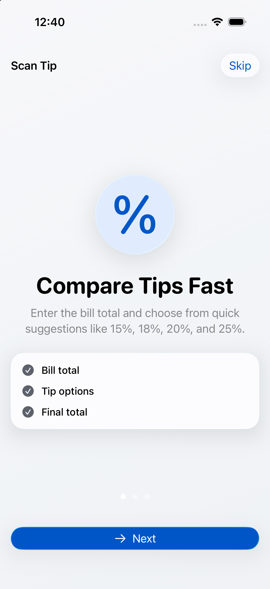
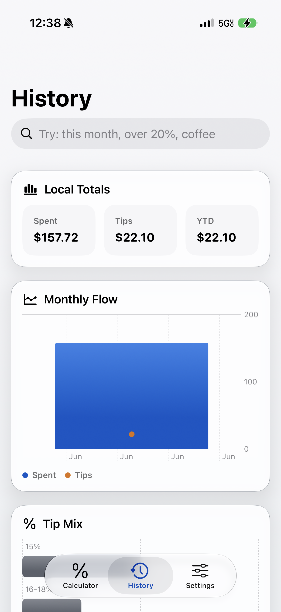
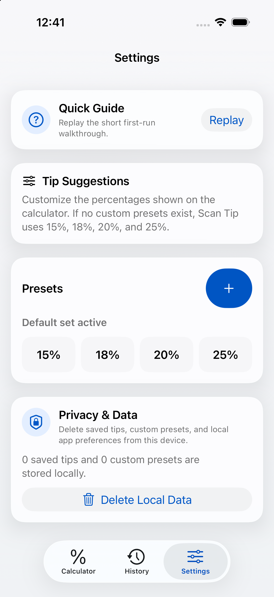

# Scan Tip

Scan Tip is a SwiftUI tip calculator for iPhone and iPad. It helps people calculate restaurant tips, scan receipts, save dining history, and customize their preferred tip presets.

The App Store listing can use the **Scan Tip** name, but the existing production bundle identifier remains:

```text
com.chiragkular.SwiftUI-TipEasy
```

## Features

- Fast bill, tip, and total calculation.
- Preset tip buttons plus custom percentage or dollar tip entry.
- Receipt scanning with camera support.
- Receipt insights for possible service charges or included gratuity.
- Saved local tip history with summary views.
- Customizable tip presets stored with SwiftData.
- Settings for appearance, onboarding replay, data controls, and privacy actions.
- App Shortcuts for common Scan Tip actions.
- iPhone and iPad support.

## App Store Links

- Marketing: https://ck4957.github.io/ScanTip/
- Support: https://ck4957.github.io/ScanTip/support.html
- Privacy Policy: https://ck4957.github.io/ScanTip/privacy.html

The static pages live in `docs/` and are published with GitHub Pages.

## Project Structure

- `Scan Tip/SwiftUI_ScanTipApp.swift`: app entry point and SwiftData model container.
- `Scan Tip/Views/ContentView.swift`: tab shell for Calculator, History, and Settings.
- `Scan Tip/Views/TipCalculatorView.swift`: main calculator, receipt scanner entry point, tip controls, save actions, and insights.
- `Scan Tip/Views/ReceiptScannerSheet.swift`: camera/receipt scanning flow.
- `Scan Tip/Views/TipHistoryView.swift`: saved transaction history and totals.
- `Scan Tip/Views/TipPresetSettingsView.swift`: preset, appearance, onboarding, and local data settings.
- `Scan Tip/Services/ReceiptIntelligenceService.swift`: receipt parsing and refinement.
- `Scan Tip/Services/TipIntelligenceService.swift`: tip explanations and anomaly checks.
- `Scan Tip/Services/ReceiptPhotoStore.swift`: local receipt image storage.
- `Scan Tip/AppIntents/ScanTipIntents.swift`: App Shortcuts.
- `docs/`: App Store metadata, privacy/support pages, release notes, and release checklists.
- `scripts/release-upload.sh`: command-line App Store archive/export/upload helper.

## Requirements

- Xcode 26.x stable for App Store submission.
- iOS 26 SDK for the current release configuration.
- Apple Developer team access for signing.
- App Store Connect API key for command-line upload.

Use stable Xcode before building for App Store Connect:

```bash
sudo xcode-select -s /Applications/Xcode.app/Contents/Developer
xcodebuild -version
```

## Local Development

Open the workspace:

```bash
open "Scan Tip.xcworkspace"
```

Build from the command line:

```bash
xcodebuild \
  -workspace "Scan Tip.xcworkspace" \
  -scheme "Scan Tip" \
  -configuration Debug \
  -destination "platform=iOS Simulator,name=iPhone 17 Pro" \
  build
```

## Release Automation

Create a local `.env` file from the template:

```bash
cp .env.example .env
```

Fill in:

```bash
ASC_API_KEY_ID="paste-api-key-id-here"
ASC_API_ISSUER_ID="paste-issuer-id-here"
ASC_APPLE_ID="paste-numeric-app-apple-id-here"
ASC_API_KEY_PATH="./ApiKey_<KEY_ID>.p8"
```

Then archive, export, validate, and upload with one command:

```bash
./scripts/release-upload.sh
```

Secrets are intentionally not committed. `.env`, `.p8` keys, local build output, archives, and IPAs are ignored by git.

For more detail, see `docs/RELEASE_AUTOMATION.md`.

## Screenshots

Current screenshots are stored in `screenshots/`.

<table>
  <tr>
    <td align="center"><br><sub>Onboarding</sub></td>
    <td align="center"><br><sub>Receipt Scanner</sub></td>
    <td align="center"><br><sub>History</sub></td>
    <td align="center"><br><sub>Settings</sub></td>
  </tr>
</table>

App Store sized screenshots are stored in `screenshots/generated/`.

## Release Notes

Version `1.2`, build `5`, adds receipt scanning, saved tip history, on-device tip insights, App Shortcuts, iPad support, and onboarding updates.

Every new upload for the same App Store version must increment `CURRENT_PROJECT_VERSION`.

Use the helper to avoid manual project-file edits:

```bash
./scripts/bump-build-number.sh
```

Run the lightweight release gate before release commits:

```bash
./scripts/release-doctor.sh
```

## Privacy

Scan Tip does not require login. Saved tip history and custom presets are stored locally on the device with SwiftData. Camera access is used for receipt scanning, and When In Use location access can attach local place details to saved tip history when approved.

See `docs/privacy.html` and `docs/APP_PRIVACY_MATRIX.md` for release review details.

## License

This project is licensed under the MIT License.
