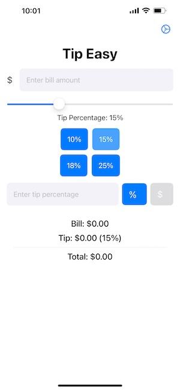

# SwiftUI TipEasy

TipEasy is a SwiftUI-based tip calculator app that simplifies calculating tips. It offers a user-friendly interface with a slider, preset buttons, and a custom input field, all while persisting custom settings.

## Project Structure

- **SwiftUI-TipEasyApp.swift**: Entry point of the application, setting up the main app structure and initializing the ContentView. Also sets up the SwiftData ModelContainer.
- **Views/**:
  - **ContentView.swift**: Main view of the application, embedding the TipCalculatorView and managing navigation to the settings.
  - **TipCalculatorView.swift**: Contains the UI elements for the tip calculator, including a slider, preset buttons (dynamically loaded from settings), and a single text field for custom tip input (percentage or amount). Handles UI updates and animations.
  - **TipPresetSettingsView.swift**: Allows users to manage custom tip percentages, adding, deleting, and modifying presets stored using SwiftData.
  - **AddEditPresetSheet.swift**: Sheet view for adding or editing individual tip presets.
- **Models/**:
  - **TipPreset.swift**: SwiftData model defining a tip preset with a percentage value.
- **Resources/Assets.xcassets**: Contains image assets and color sets for the application, supporting both light and dark modes.

## Features

- Bill amount input field.
- Slider for selecting tip percentages.
- Dynamically loaded preset tip percentages (customizable in settings).
- Single input field for custom tip, togglable between percentage and dollar amount.
- Persisted custom tip percentages using SwiftData.
- Settings screen to manage custom tip presets.
- Support for light and dark mode.
- Clean and modern UI with background gradients.

## Usage

1.  Clone the repository or download the project files.
2.  Open the project in Xcode.
3.  Run the application on a simulator or a physical device.
4.  Enter the bill amount.
5.  Select a tip percentage using the slider, preset buttons, or custom input field.
6.  View the calculated tip and total amount displayed on the screen.
7.  Customize tip presets by tapping the gear icon to navigate to the settings screen.

## Technologies Used

- SwiftUI
- SwiftData
- Combine (for debouncing)

## Screenshots

 

## License

This project is licensed under the MIT License.
